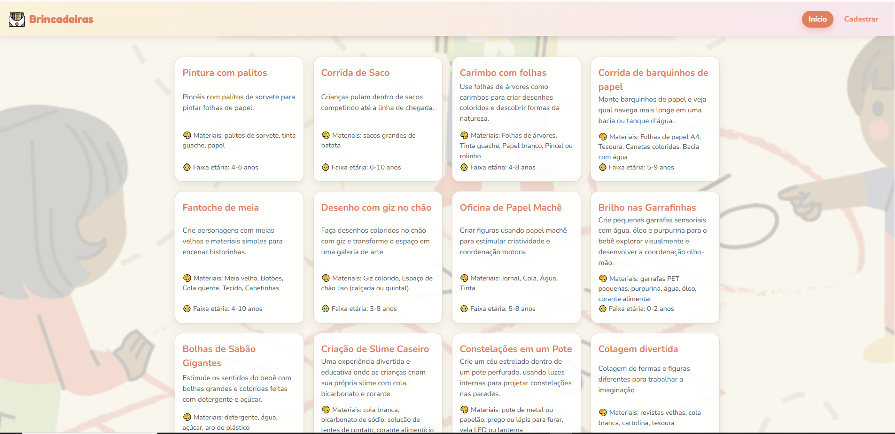
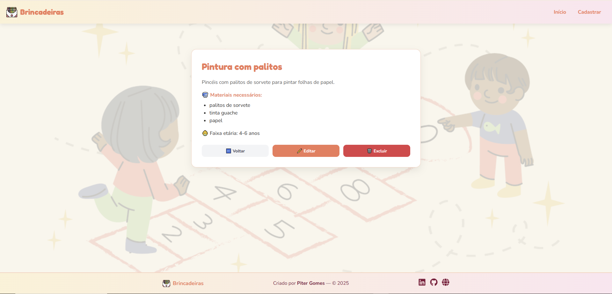
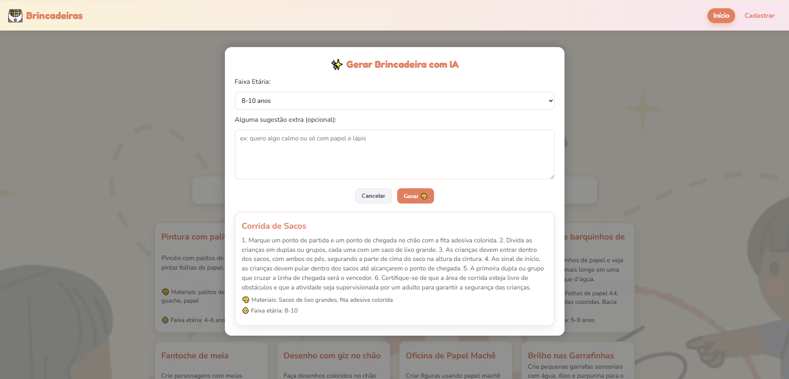
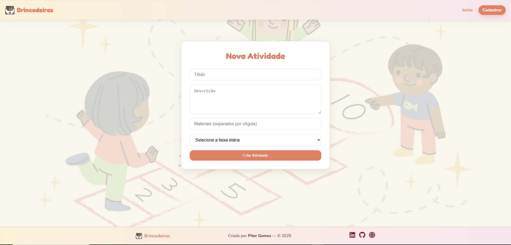

<h1 align="center">
  
  Brincadeiras
</h1>

<p align="center">
  🌎 <strong>Languages:</strong><br>
  <a href="README.md">🇧🇷 Português</a> |
  <a href="README.en.md">🇺🇸 English</a>
</p>

O **Brincadeiras** é um aplicativo que permite ao usuário buscar ou receber sugestões de atividades criativas para crianças, utilizando materiais simples como papel, palito, barbante, etc.  

O objetivo é **estimular a criatividade e o brincar livre** com ideias práticas e acessíveis.

## 🚀 Como acessar o projeto (importante!)

O backend do projeto está hospedado no **Render**, que pode hibernar após algum tempo sem uso. O frontend está hospedado normalmente na **Vercel**.

Para garantir que tudo funcione corretamente, siga estes passos:

### 1️⃣ Acorde o backend no Render

Antes de abrir o site, acesse: 👉 [**Backend - Clique Aqui**](https://brincadeiras-backend.onrender.com/)

Isso fará o Render “acordar” o servidor.

- O processo costuma levar **20 a 40 segundos**.  
- Caso pareça travado, aguarde — é normal na versão gratuita.  
- Quando a página mostrar algo como *"Backend Ativo!"* ou mensagem semelhante, já estará pronto.

### 2️⃣ Acesse o frontend normalmente

Depois que o backend estiver acordado, abra o app: 👉 [**Frontend - Clique Aqui**](https://brincadeiras-one.vercel.app/)

Agora todas as funcionalidades estarão disponíveis:

- Buscar por atividades  
- Gerar sugestões aleatórias  
- Filtrar por faixa etária  
- Ver detalhes das atividades  

### ℹ️ Por que isso é necessário?

O Render Free Tier coloca projetos para “hibernar” após um período sem acessos. Quando isso acontece, a primeira requisição do dia precisa “acordar” o servidor — o que causa essa espera inicial.

## 🏆 Motivação

Durante a infância, o brincar é essencial para o desenvolvimento cognitivo e social. Como aluno de Ciências da Computação, este projeto surgiu da necessidade de criar brincadeiras criativas e educativas para crianças, combinando interesse pessoal com aprendizado profissional.

Além de proporcionar atividades práticas e acessíveis para crianças, o projeto permitiu desenvolver competências em **desenvolvimento full-stack**, integração com **banco de dados**, tratamento de **APIs REST**, implementação de **inteligência artificial** e deploy de aplicações web completas.  

## 📚 Aprendizado

Durante o desenvolvimento do projeto, foram aplicadas e aprimoradas habilidades em:

- **Frontend:** React, Vite, CSS responsivo, React Router, Axios, React-Toastify.
- **Backend:** Spring Boot, API REST, Spring Security, tratamento global de exceções, logging.
- **Banco de Dados:** Modelagem e integração com MongoDB Atlas.
- **Inteligência Artificial:** Integração com OpenAI GPT-3.5 para geração automática de atividades.
- **Deploy:** Backend no Render e frontend no Vercel.

---

## 🧱 Estrutura Geral

| Camada         | Tecnologia     | Função Principal                                                              |
|----------------|----------------|-------------------------------------------------------------------------------|
| Frontend       | React + Vite   | Interface para visualizar, filtrar, adicionar, editar e gerar atividades com IA |
| Backend        | Spring Boot    | API REST com logs, tratamento global de exceções e geração automática via IA |
| Banco de Dados | MongoDB        | Armazena atividades e materiais |
| IA             | OpenAI GPT-3.5 | Geração automática de ideias de atividades |

---

## ⚙️ Tecnologias e Ferramentas

### 🎨 Frontend (React + Vite)

- ✅ React 18+  
- ✅ Axios  
- ✅ React Router  
- ✅ CSS3 responsivo  
- ✅ Vite  
- ✅ React-Toastify  
- ✅ ModalGerarIA.jsx  

**Funcionalidades atuais:**

- Cards de atividades do backend  
- Filtros por título, faixa etária e materiais  
- Comunicação correta via Axios  
- Home, DetalheAtividade e NovaAtividade  
- Navbar e Footer responsivos  
- Modal de geração IA com scroll interno e desativação de botões durante geração  
- Visual renovado com tipografia l??dica, cores padronizadas e responsividade completa  

---

### ⚙️ Backend (Spring Boot + MongoDB)

- ✅ Spring Boot 3+  
- ✅ Spring Web (APIs REST)  
- ✅ Spring Data MongoDB  
- ✅ Lombok  
- ✅ Spring Boot DevTools  
- ✅ Spring Security (SecurityConfig.java)  
- ✅ CORS configurado (WebConfig.java)  
- ✅ Tratamento de exceções centralizado (GlobalExceptionHandler.java)  
- ✅ Endpoint `/atividades/gerar`  
- ✅ Suporte à geração automática via IA (OpenAI GPT-3.5-turbo)  
- ✅ Estrutura de dados ajustada: retorna titulo, descricao, materiais, faixaEtaria, id e tipo  
- ✅ Tratamento de erros da API da OpenAI e logging aprimorado  
- ✅ Dependências adicionadas para integração com OpenAI  

**Endpoints implementados:**

| Método | Rota         | Função                             | Status |
|--------|--------------|-----------------------------------|--------|
| GET    | /atividades  | Lista todas as atividades          | ✅     |
| POST   | /atividades | Cadastra nova atividade (usar `CadastrarAtividadeRequest`) | ✅ |
| GET    | /atividades/{id} | Detalha uma atividade | ✅ |
| PUT    | /atividades/{id} | Atualiza uma atividade | ✅ |
| DELETE | /atividades/{id} | Remove uma atividade | ✅ |
| POST   | /atividades/gerar | Gera atividade automaticamente via IA | ✅ |

---

### 🗄️ Banco de Dados (MongoDB Atlas)

- ✅ Cluster criado e conectado ao Spring Boot  
- ✅ Testes via Compass e Postman concluídos  
- ✅ Estrutura do documento:

```json
{
  "titulo": "Pintura com palitos de sorvete",
  "descricao": "Monte um pincel com palitos e barbante e pinte figuras coloridas",
  "materiais": ["palitos de sorvete", "barbante", "tinta guache", "papel"],
  "faixaEtaria": "4-6 anos"
}
```
---
### 🤖 Inteligência Artificial

- ✅ Endpoint /atividades/gerar
- ✅ Conexão com OpenAI GPT-3.5-turbo
- ✅ Frontend integrado via ModalGerarIA.jsx
- ✅ Atividades retornam título, descrição, materiais, faixaEtaria, id e tipo
- ✅ Botão “✨ Gerar ideia com IA” estilizado, funcional e desativa botões durante a geração

## 📸 Capturas de Tela

Cards:


Detalhe (editar/excluir):


Modal IA:


Cadastro:


## 🧭 Fluxo da Aplicação

```scss
Usuário → Frontend (React)
↓
API REST (Spring Boot, Spring Security, logs, tratamento de exceções, geração de IA)
↓
MongoDB (Atlas)
↑
(IA gera ideias automáticas e retorna ao frontend)
```

## ✅ Status Atual

| Área          | Status        | Descrição |
|---------------|---------------|-----------|
| Backend       | ✅ Concluído   | CRUD completo + geração automática via IA + MongoDB + logs + validações + tratamento global |
| Frontend      | ✅ Concluído   | Home, filtros, detalhe, cadastro e geração de IA integrados |
| Integração    | ✅ Testada     | Axios + Spring Boot funcionando |
| Banco de Dados| ✅ Operacional | Sincronizado com backend |
| IA            | ✅ Implementada| Endpoint e frontend integrados com OpenAI |
| Deploy        | ✅ Concluído   | Backend → Render, Frontend → Vercel |

## 🗂️ Estrutura de Pastas (essencial)

```bash
brincadeiras/
├── 📂 backend/
│   ├── 📂 src/
│   │   ├── 📂 main/
│   │   │   ├── 📂 java/com/brincadeiras/
│   │   │   │   ├── 📂 config/           # Segurança, CORS e Logs
│   │   │   │   ├── 📂 controller/       # Endpoints da API
│   │   │   │   ├── 📂 dto/              # Objetos de transferência de dados
│   │   │   │   ├── 📂 model/            # Entidades (Atividade)
│   │   │   │   ├── 📂 repository/       # Interface com o Banco de Dados
│   │   │   │   ├── 📂 service/          # Lógica de negócio
│   │   │   │   └── BrincadeirasBackendApplication.java
│   │   │   └── 📂 resources/
│   │   │       ├── application.properties
│   │   │       └── application-secret.properties
│   │   └── 📂 test/                     # Testes unitários e integração
│   ├── Dockerfile                       # Configuração de container
│   └── pom.xml                          # Dependências Maven
├── 📂 docs/
│   └── 📂 images/                       # Screenshots da documentação
├── 📂 frontend/
│   ├── 📂 public/                       # Assets estáticos (ícones, imagens)
│   ├── 📂 src/
│   │   ├── 📂 components/               # Componentes React reutilizáveis
│   │   ├── 📂 pages/                    # Telas principais (Home, Nova Atividade)
│   │   ├── 📂 services/                 # Configuração do Axios/Fetch (api.js)
│   │   ├── App.jsx                      # Rotas e estrutura principal
│   │   ├── index.css                    # Estilização global
│   │   └── main.jsx                     # Ponto de entrada React
│   ├── .env.example                     # Exemplo de variáveis de ambiente
│   ├── package.json                     # Scripts e dependências JS
│   └── vite.config.js                   # Configuração do Vite
├── LICENSE
├── README.md                            # Documentação principal
└── .gitignore                           # Filtro de arquivos ignorados
```

## 📜 Licença

Este projeto está sob a licença **MIT**.

## 🧑‍💻 Autor

**Piter Gomes** - Estudante de Ciências da Computação (5° Período) e Full-Stack Developer.

📧 [**E-mail**](mailto:piterg.bio@gmail.com) | 💼 [**LinkedIn**](https://www.linkedin.com/in/piter-gomes-4a39281a1/) | 💻 [**GitHub**](https://github.com/pitercoding) | 🌐 [**Portfólio**](https://portfolio-pitergomes.vercel.app/)

---
